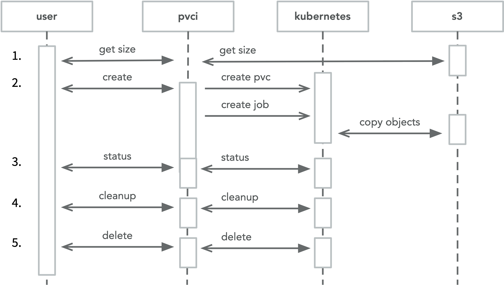

# WIP: PVCI
## Persistent Volume Claim Injector

PVCI runs as a web service in a Kubernetes cluster and exposes an API for creating [PersistentVolumeClaims](https://kubernetes.io/docs/concepts/storage/persistent-volumes/) populated with objects from an S3 compatible ([Minio](https://min.io/) or AWS) storage system.

## Overview



## API

1. **POST** body for `/size`:
```json
{
    "s3_ssl": false,
    "s3_endpoint": "obj-service.data:9000",
    "s3_bucket": "datasets",
    "s3_prefix": "testset",
    "s3_key": "{{DEV_OBJ_KEY}}",
    "s3_secret": "{{DEV_OBJ_SECRET}}"
}
```


2. **POST** body for `/create`:
```json
{
    "s3_ssl": false,
    "s3_endpoint": "obj-service.data:9000",
    "s3_bucket": "datasets",
    "s3_prefix": "testset",
    "s3_key": "{{DEV_OBJ_KEY}}",
    "s3_secret": "{{DEV_OBJ_SECRET}}",
    "namespace": "default",
    "storage_class": "rook-ceph-block",
    "name": "test-dataset-1"
}
```


3. **POST** body for `/status`:
```json
{
    "namespace": "default",
    "name": "test-dataset-1"
}
```

4. **POST** body for `/cleanup`:
```json
{
    "namespace": "default",
    "name": "test-dataset-1"
}
```

5. **POST** body for `/delete`:
```json
{
    "namespace": "default",
    "name": "test-dataset-1"
}
```

## Develoment

### Release
```bash
goreleaser --skip-publish --rm-dist --skip-validate
```

```bash
GITHUB_TOKEN=$GITHUB_TOKEN goreleaser --rm-dist
```
